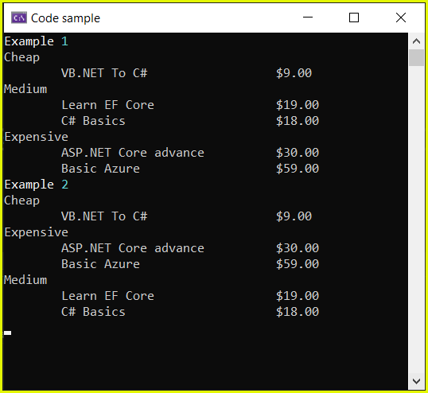
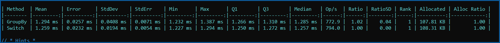

# About

This project shows two different ways to group books by price range.

A developer writes SQL to group books by price range as shown below.

```sql
SELECT Id, 
       Title, 
       format(Price,'C2','en-US') Price,
       CASE
           WHEN Price < 10
           THEN 'Cheap'
           WHEN Price > 10 AND Price < 20
           THEN 'Medium'
           ELSE 'Expensive'
       END AS PriceRange
FROM dbo.book
WHERE Price IN
(
    SELECT Price
    FROM dbo.book
    GROUP BY Price
    HAVING COUNT(*) = 1
)
ORDER BY PriceRange
```

Then wants to write the same query with EF Core.


First read all books

```csharp
await using var context = new BookContext();
var books = await context.Book.ToListAsync();
```

## First try

Create a dictionary for price ranges descriptions

```csharp
private static Dictionary<int, string> PriceRange() 
    => new()
    {
        { 10, "Cheap" }, { 20, "Medium" }, { 30, "Expensive" }
    };
```

Write code to perform group by which displays the data.

```csharp
await using var context = new BookContext();
var books = await context.Book.ToListAsync();

List<IGrouping<int, Book>> results = books
    .GroupBy(book => book.Price < 10 ? 10 : (book.Price < 20 ? 20 : 30))
    .OrderBy(grouping => grouping.Key)
    .ToList();
```

## Second try

Uses a switch expression to group books by price range rather than depending on a dictionary.

```csharp
await using var context = new BookContext();
var books = await context.Book.ToListAsync();
List<GroupSwitch> results = books
    .GroupBy(book => book.Price switch
    {
        <= 10 => "Cheap",
        > 10 and <= 20 => "Medium",
        _ => "Expensive"
    })
    .Select(g => new GroupSwitch(g.Key, g.ToList()))
    .OrderBy(ca => ca.Category)
    .ToList();
```

Both display the exact same results as shown below.




## Benchmarks

The benchmark project compares the performance of the two methods. Little difference in performance is observed but in other cases there may be significate differences.

When there are performance issues this can be a good place to start than if the performance is not acceptable then look at the SQL generated by EF Core and see if it can be improved followed by Visual Studio's performance profiler.



