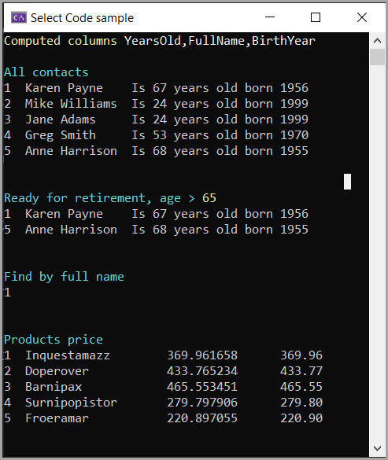
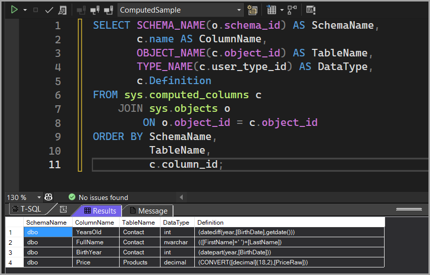

# About

Simple example showing computed columns.



Below shows how to get comuted columns with SQL statement.



With Entity Framework Core reverse engineered with [EF Power Tools](https://marketplace.visualstudio.com/items?itemName=ErikEJ.EFCorePowerTools), the computed columns are included in the model defined in the DbContext.

```csharp
modelBuilder.Entity<Contact>(entity =>
{
    entity.HasIndex(e => e.BirthDate, "NonClusteredIndexYearsOld");

    entity.Property(e => e.BirthYear)
        .HasComputedColumnSql("(datepart(year,[BirthDate]))", false);

    entity.Property(e => e.FullName)
        .HasComputedColumnSql("(([FirstName]+' ')+[LastName])", false);

    entity.Property(e => e.YearsOld)
        .HasComputedColumnSql("(datediff(year,[BirthDate],getdate()))", false);

});

modelBuilder.Entity<Products>(entity =>
{
    entity.Property(e => e.Price)
        .HasComputedColumnSql("(CONVERT([decimal](18,2),[PriceRaw]))", false)
        .HasColumnType("decimal(18, 2)");
    entity.Property(e => e.PriceRaw).HasColumnType("decimal(18, 6)");
    entity.Property(e => e.ProductName).IsRequired();
});
```

## See also

[SQL-Server: Computed columns with Ef Core](https://dev.to/karenpayneoregon/sql-server-computed-columns-with-ef-core-3h8d) article.

