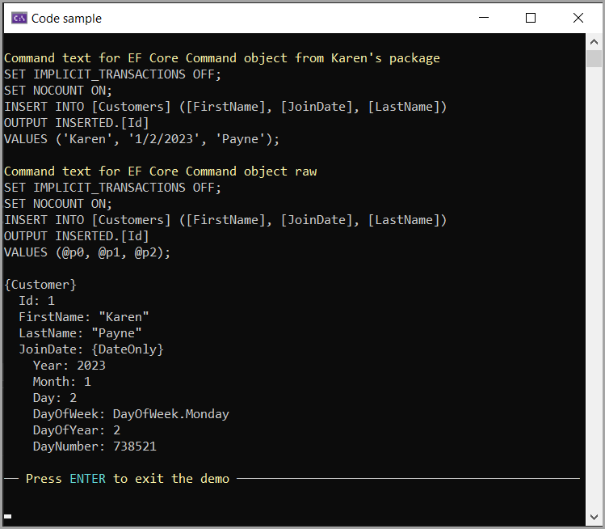

# About

Base code is Microsoft with modifications by Karen Payne.

Note: Karen add NuGet package [DbPeekQueryLibrary](https://www.nuget.org/packages/DbPeekQueryLibrary/#readme-body-tab) to peek at the command text in the interceptor, mainly to see if it would work as it was not designed for EF Core but IDbCommand which is exposed via DbCommand in CommandSourceInterceptor.InterceptionResult

