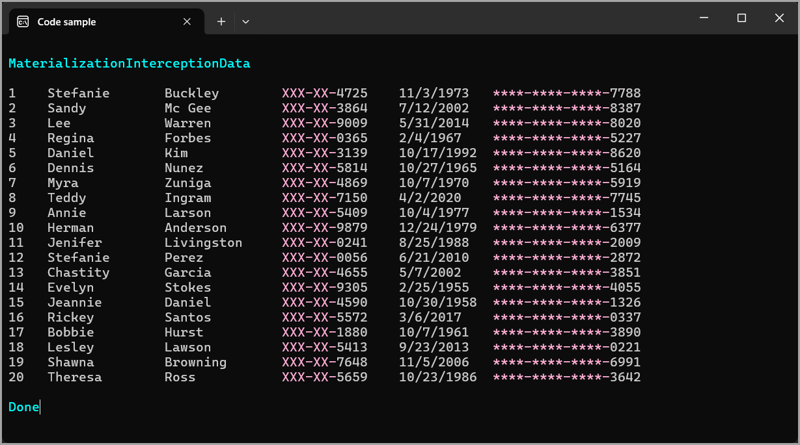

<!--TOC-->
- [About](#about)
  - [AI Generation](#ai-generation)
    - [Benefits of AI Generation](#benefits-of-ai-generation)
  - [Important](#important)
<!--/TOC-->
# About

An example on using an EF Core `IMaterializationInterceptor` to mask SSN and creditcard data in a database. This can be useful for quick and dirty data masking in development or testing environments, but it is not a substitute for proper security measures in production.



## AI Generation

For the two interceptors, the `SSNMaskingInterceptor` and `CreditCardMaskingInterceptor`, the code was generated using [ChatGPT](https://openai.com/chatgpt).

- SSN was genereted frst
- CreditCard was generated second using SSN as a model

### Benefits of AI Generation

If a developer does not know how to create a custom interceptor, they can use `ChatGPT` or `Copilot` to generate the code. This is a great way to learn how to create custom interceptors and how to use them in EF Core.

When a developer knows how to create a custom interceptor, they can use AI generation to speed up the process. This is a great way to save time and effort when creating custom interceptors.

## Important

For a real application consider using [Dynamic data masking](https://learn.microsoft.com/en-us/sql/relational-databases/security/dynamic-data-masking?view=sql-server-ver16) which works on user permissions and roles. 

Simple example

```sql
CREATE TABLE dbo.Taxpayers
(
    Id INT IDENTITY PRIMARY KEY,
    FullName NVARCHAR(100) NOT NULL,
    Email NVARCHAR(100) NOT NULL,
    Social VARCHAR(9) MASKED WITH (FUNCTION = 'partial(0,"XXXXX",4)') NOT NULL,
    BirthDate DATE  NOT NULL
);

INSERT INTO dbo.Taxpayers(FullName,Email,Social,BirthDate) VALUES('Jane Gallagher', 'gallagherjane@gmail.com', '123456789', '1980-01-21');
-- Create a non-privileged user
CREATE USER NonPrivilegedUser WITHOUT LOGIN;
-- Grant SELECT permission
GRANT SELECT ON Taxpayers TO NonPrivilegedUser;
-- Impersonate the user to show initial masked view
EXECUTE AS USER = 'NonPrivilegedUser';
-- Query the data
SELECT Id,FullName,Email,Social AS "SSN Masked",BirthDate FROM dbo.Taxpayers;
-- Revert impersonation
REVERT;
-- Grant UNMASK permission
GRANT UNMASK TO NonPrivilegedUser;
-- Impersonate again to show unmasked view
EXECUTE AS USER = 'NonPrivilegedUser';
-- Query the data
SELECT Id,FullName,Email,Social,BirthDate FROM dbo.Taxpayers;
-- Revert impersonation
REVERT;
-- Remove the user
DROP USER NonPrivilegedUser;
-- Drop the table
DROP TABLE dbo.Taxpayers;
```