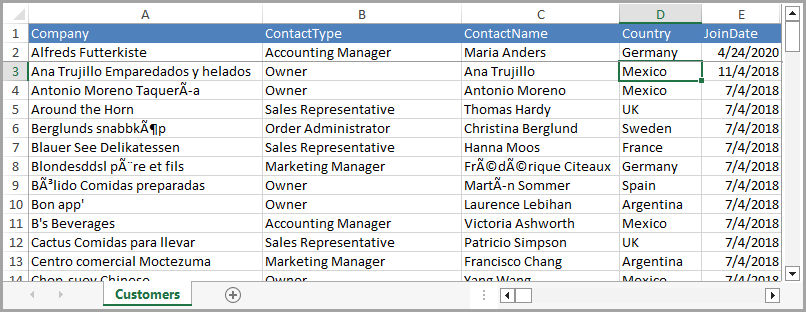

# About

An example which reads from a specific worksheet in an Excel file with the first row columns matching property names of the Customers class followed by saving the data read from the worksheet to a table in a SQL-Server database table.

## Database

- Create Examples database
- Run Scripts\populate.sql
- On each run the table is emptied using Dapper NuGet package.

## Connection string

Is in Data\Context.cs

# Requies

- EF Core 8
- [ExcelMapper](https://www.nuget.org/packages/ExcelMapper/5.2.568?_src=template) NuGet package and [documentation](https://github.com/mganss/ExcelMapper/tree/master).

## Model

```csharp
public partial class Customers
{
    public int Id { get; set; }

    public string Company { get; set; }

    public string ContactType { get; set; }

    public string ContactName { get; set; }

    public string Country { get; set; }

    public DateOnly JoinDate { get; set; }
}
```

## Worksheet

