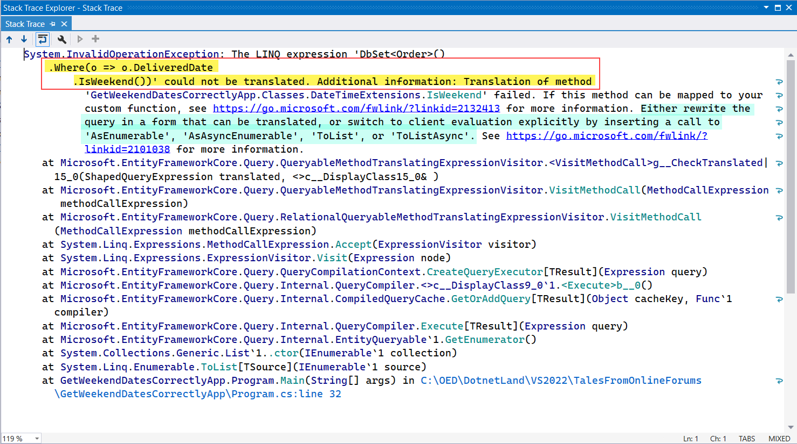
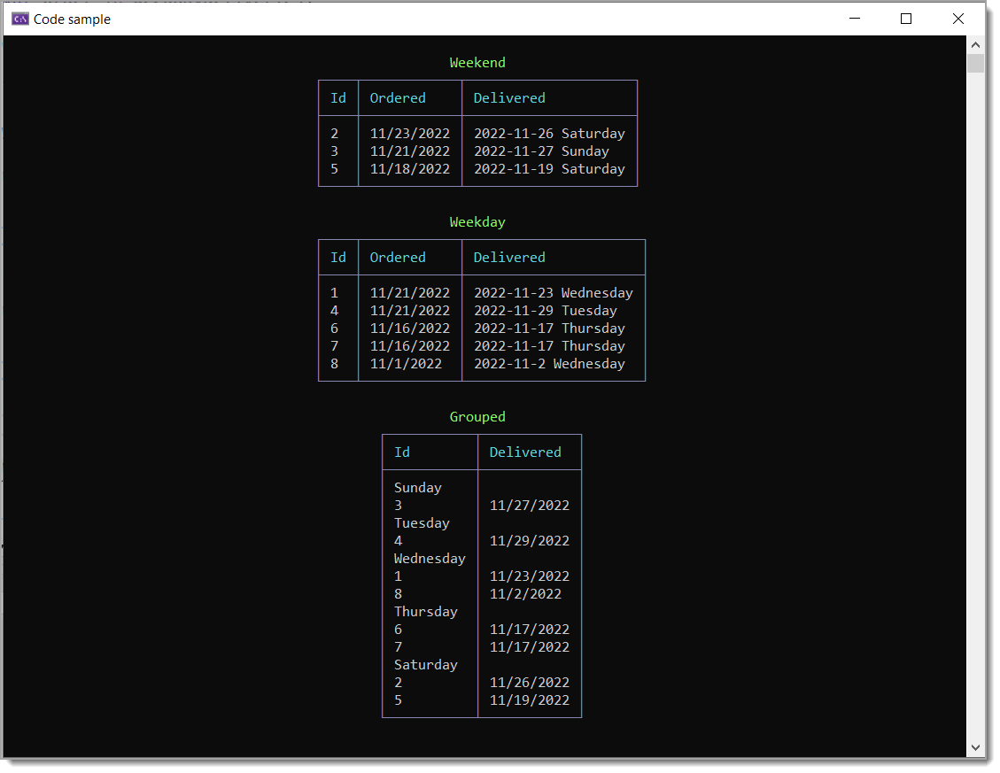

# Reading EF Core error messages

A common mistake developers make is writing a query for EF Core as follows and get the exception shown in figure 1. The solution is simple, use `AsEnumerable` as stated in the error itself `or switch to client evaluation explicitly by inserting a call to 'AsEnumerable', 'AsAsyncEnumerable', 'ToList', or 'ToListAsync'`

```csharp
context.Orders.Where(o => o.DeliveredDate.IsWeekend()).ToList();
```

Revised query

```csharp
context.Orders.AsEnumerable().Where(o => o.DeliveredDate.IsWeekend()).ToList();
```

The same holds true when performing other operations like grouping data. In this case group by `DayOfWeek` for a property `DeliveredDate`. To keep code clean we can use extension methods.

```csharp
internal static class DateTimeExtensions
{

    public static bool IsWeekDay(this DayOfWeek sender)
    {
        return sender == DayOfWeek.Monday || sender == DayOfWeek.Tuesday || sender == DayOfWeek.Wednesday ||
               sender == DayOfWeek.Thursday || sender == DayOfWeek.Friday;
    }

    public static bool IsWeekend(this DayOfWeek sender) => !sender.IsWeekDay();
}
```

Then to write the query remember client side evaluation using `AsEnumerable`

```csharp
var groupWeekend = context.Orders
    .AsEnumerable()
    .GroupBy(o => o.DeliveredDate.DayOfWeek)
    .Select(o => new { DayOfWeek = o.Key, List = o.ToList() })
    .OrderBy(x => x.DayOfWeek)
    .ToList();
```

If the desire is to use the grouped data in other places we need to go from an *anonymous* to strong type using the model below.

```csharp
public class ItemContainer
{
    public DayOfWeek DayOfWeek { get; }
    public List<Order> List { get; }

    public ItemContainer(DayOfWeek dayOfWeek, List<Order> list)
    {
        DayOfWeek = dayOfWeek;
        List = list;
    }
}
```

Then use the model

```csharp
var groupWeekend = context.Orders
    .AsEnumerable()
    .GroupBy(o => o.DeliveredDate.DayOfWeek)
    .Select(o => new ItemContainer(o.Key, o.ToList()))
    .OrderBy(x => x.DayOfWeek)
    .ToList();
```


# Lesson learned 

Before search the web for assistance, read if available recommendations in error messages which either give you the path to take to resove the issue or allows a developer to ask a well formed question in online forums like Stackoverflow.


# See also

- Microsoft: [Client vs. Server Evaluation](https://learn.microsoft.com/en-us/ef/core/querying/client-eval)


**Figure 1**




Code sample screenshot



