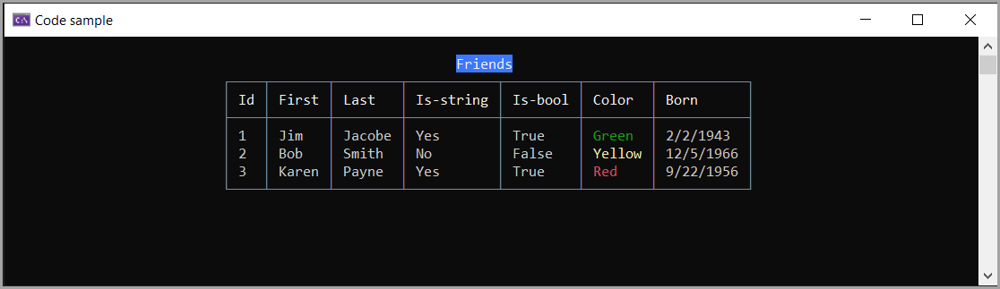

# About

EF Core code sample for 

- HasConversion
    - BoolToStringConverter
    - System.Drawing.Color to and from string
    - DateTime local to Utc 


Originally written with NET5, updated to NET8

```csharp
protected override void OnModelCreating(ModelBuilder modelBuilder)
{

    modelBuilder.Entity<Person>()
        .Property(person => person.IsFriend)
        .HasConversion(new BoolToStringConverter("No", "Yes"));

    modelBuilder.Entity<Person>()
        .Property(person => person.Color)
        .HasConversion(
            color => color.Name,
            value => Color.FromName(value));


    var dateTimeConverter = new ValueConverter<DateTime, DateTime>(
        datetime => datetime,
        dateTime => DateTime.SpecifyKind(dateTime, DateTimeKind.Utc));


    foreach (var entityType in modelBuilder.Model.GetEntityTypes())
    {
        foreach (var property in entityType.GetProperties())
        {
            if (property.ClrType == typeof(DateTime) || property.ClrType == typeof(DateTime?))
            {
                property.SetValueConverter(dateTimeConverter);
            }
        }
    }

}
```

