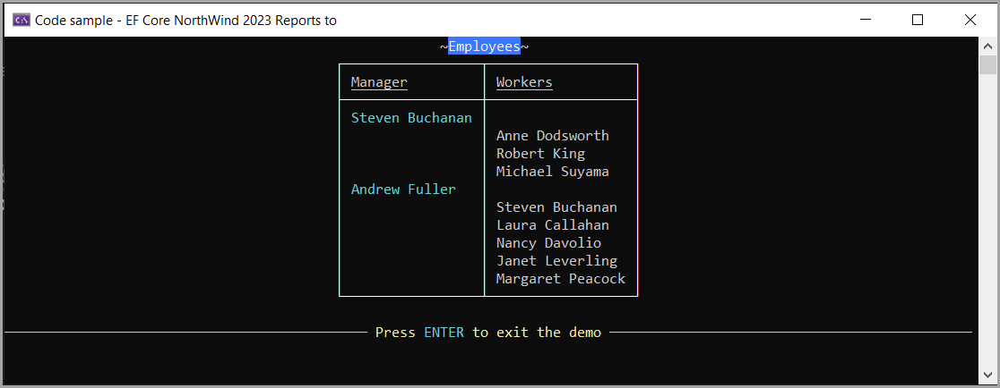

# About

EF Core code samples using a modified version of NorthWind database, script to create and populate is located in the script folder.

- `EmployeeOperations.EmployeeReportsTo` is an example of a self-referencing table for managers and workers.

