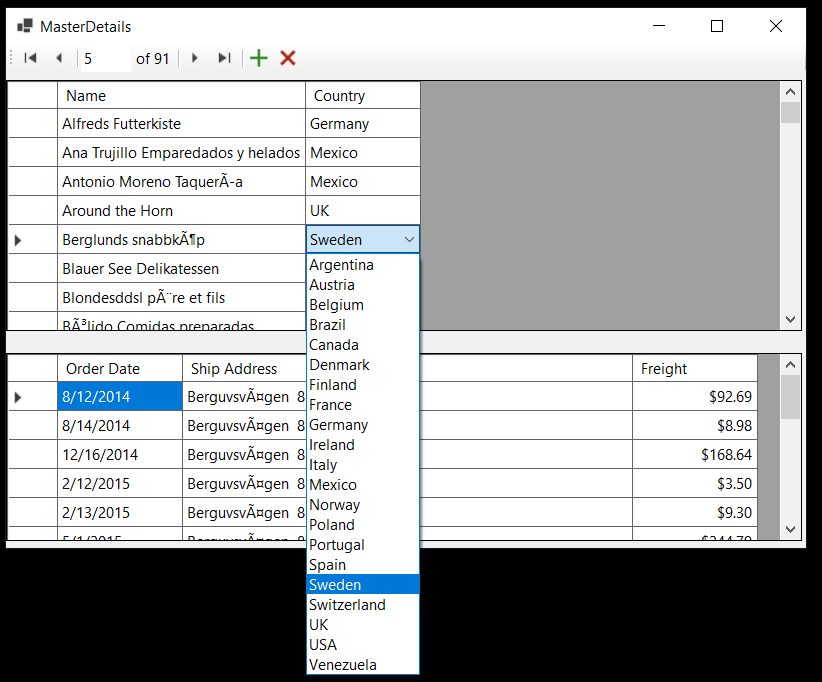

# About

This project is a basic example of using Entity Framework Core 8 in a Windows Forms project.

## Form1

- Supplier column in the DataGridView should be a drop down. See my [article](https://dev.to/karenpayneoregon/learn-to-use-a-databound-datagridview-combobox-in-windows-forms-1coa) on how to setup a drop down.
- For changing data outside the form controls implement `INotifyPropertyChanged` as done in Product model.
- `SortableBindingList` under components folder provides sorting for the DataGridView.

The way code is setup work with the BindingList and BindingSource to work with data rathe than accessing data in this case from the DataGridView.

:curly_loop: Connection string is in `appsettings.json`

## MasterDetail form

Shows how to setup

- Customer/Orders master detail
    - DataGridView columns
    - Set in designer
        - DataGridViewComboBox for country is a model for using data bound combobox that only displays when needed.
- Change detection when user changes data in the master DataGridView
- Use a BindingNavigator (not exposed in .NET Core)
    - Override add/remove buttons
- FluentValidation, one property but which can be expanded on

## Setup

- In SSMS create `NorthWind2024 `database
- Run `populate.sql` under the script folder.