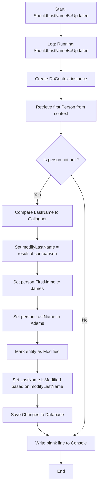
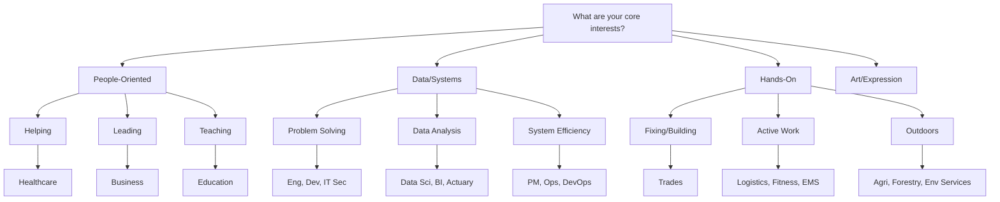

```mermaid
flowchart TD
    A[Start: ShouldLastNameBeUpdated] --> B[Log: Running ShouldLastNameBeUpdated]
    B --> C[Create DbContext instance]
    C --> D[Retrieve first Person from context]
    D --> E{Is person not null?}
    E -- Yes --> F[Compare LastName to Gallagher]
    F --> G[Set modifyLastName = result of comparison]
    G --> H[Set person.FirstName to James]
    H --> I[Set person.LastName to Adams]
    I --> J[Mark entity as Modified]
    J --> K[Set LastName.IsModified based on modifyLastName]
    K --> L[Save Changes to Database]
    L --> M[Write blank line to Console]
    M --> N[End]
    E -- No --> M

```

---

```mermaid
---
config:
  layout: dagre
---
flowchart TD
    A["What are your core interests?"] 
    A --> B["People-Oriented"]
    A --> C["Data/Systems"]
    A --> D["Hands-On"]
    A --> E["Art/Expression"]

    B --> B1["Helping"] --> F["Healthcare"]
    B --> B2["Leading"] --> G["Business"]
    B --> B3["Teaching"] --> H["Education"]

    C --> C1["Problem Solving"] --> I["Eng, Dev, IT Sec"]
    C --> C2["Data Analysis"] --> J["Data Sci, BI, Actuary"]
    C --> C3["System Efficiency"] --> K["PM, Ops, DevOps"]

    D --> D1["Fixing/Building"] --> L["Trades"]
    D --> D2["Active Work"] --> M["Logistics, Fitness, EMS"]
    D --> D3["Outdoors"] --> N["Agri, Forestry, Env Services"]
```