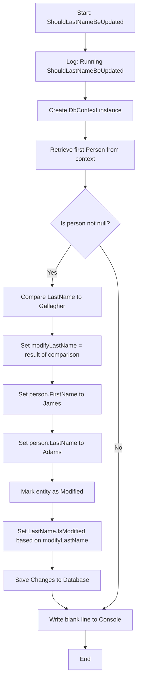

```mermaid
flowchart TD
    A[Start: ShouldLastNameBeUpdated] --> B[Log: Running ShouldLastNameBeUpdated]
    B --> C[Create DbContext instance]
    C --> D[Retrieve first Person from context]
    D --> E{Is person not null?}
    E -- Yes --> F[Compare LastName to Gallagher]
    F --> G[Set modifyLastName = result of comparison]
    G --> H[Set person.FirstName to James]
    H --> I[Set person.LastName to Adams]
    I --> J[Mark entity as Modified]
    J --> K[Set LastName.IsModified based on modifyLastName]
    K --> L[Save Changes to Database]
    L --> M[Write blank line to Console]
    M --> N[End]
    E -- No --> M

```

