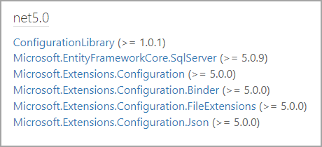

# Entity Framework Core shadow properties

[Shadow properties](https://docs.microsoft.com/en-us/ef/core/modeling/shadow-properties) are properties that are not defined in your .NET entity class but are defined for that entity type in the EF Core model. The value and state of these properties is maintained purely in the Change Tracker. Shadow properties are useful when there is data in the database that should not be exposed on the mapped entity types. Code samples presented will provided simple, useful examples for using shadow properties using a class project for Entity Framework Core code logic with a Windows form project to present data from a SQL-Server database,

Filter out soft `delete`

```csharp
modelBuilder.Entity<Contact1>()
    .HasQueryFilter(m =>
        EF.Property<bool>(m, "isDeleted") == false);
```

Override `SaveChanges` for shadow properties. Note that SaveChangesAsync should also be overridden if this was for a real application.

```csharp
public override int SaveChanges()
{
    ChangeTracker.DetectChanges();

    foreach (var entry in ChangeTracker.Entries())
    {

        if (entry.State == EntityState.Added || entry.State == EntityState.Modified)
        {
            entry.Property("LastUpdated").CurrentValue = DateTime.Now;
            entry.Property("LastUser").CurrentValue = Environment.UserName;

            if (entry.Entity is Contact1 && entry.State == EntityState.Added)
            {
                entry.Property("CreatedAt").CurrentValue = DateTime.Now;
                entry.Property("CreatedBy").CurrentValue = Environment.UserName;
            }
        }
        else if (entry.State == EntityState.Deleted)
        {
            // Change state to modified and set delete flag
            entry.State = EntityState.Modified;
            entry.Property("isDeleted").CurrentValue = true;
        }

    }

    return base.SaveChanges();
}
```
Records with `1 (true)` for isDeleted will not be accessible without using [IgnoreQueryFilters](https://docs.microsoft.com/en-us/dotnet/api/microsoft.entityframeworkcore.entityframeworkqueryableextensions.ignorequeryfilters?view=efcore-6.0) when reading data.

```csharp
public static List<Contact1> WithNoFilter()
{
    using var context = new Context();
    return context.Contacts1.IgnoreQueryFilters().ToList();
}
```


</br>


