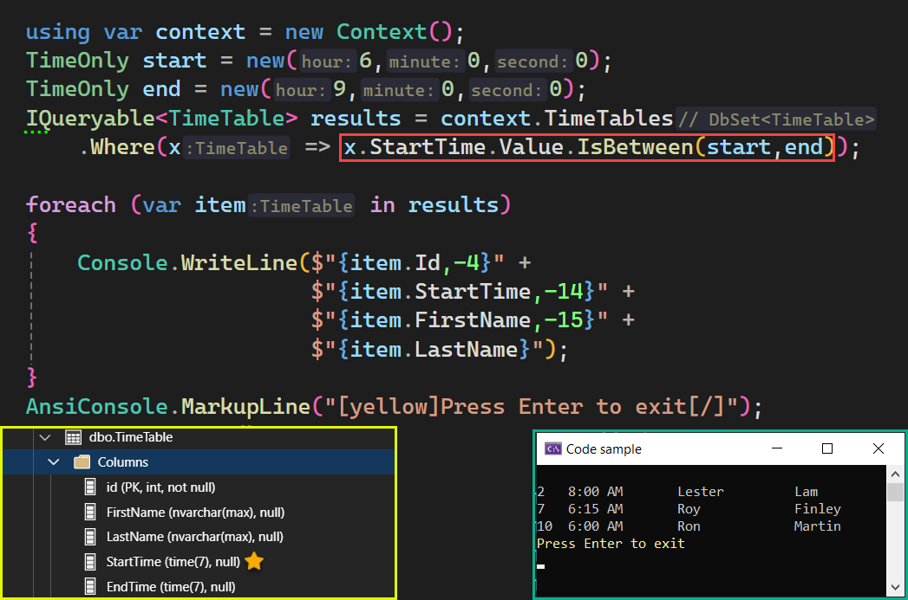

# About

An example for TimeOnly [IsBetween](https://learn.microsoft.com/en-us/ef/core/providers/sql-server/functions) which was introduced with EF Core 8.




```
info: 12/3/2023 07:46:44.805 RelationalEventId.CommandExecuted[20101] (Microsoft.EntityFrameworkCore.Database.Command) 
      Executed DbCommand (29ms) [Parameters=[@__start_0='06:00' (DbType = Time), @__end_1='09:00' (DbType = Time)], CommandType='Text', CommandTimeout='30']
      SELECT [t].[id], [t].[EndTime], [t].[FirstName], [t].[LastName], [t].[StartTime]
      FROM [TimeTable] AS [t]
      WHERE CASE
          WHEN [t].[StartTime] >= @__start_0 THEN CAST(1 AS bit)
          ELSE CAST(0 AS bit)
      END & CASE
          WHEN [t].[StartTime] < @__end_1 THEN CAST(1 AS bit)
          ELSE CAST(0 AS bit)
      END = CAST(1 AS bit)
----------------------------------------
```

